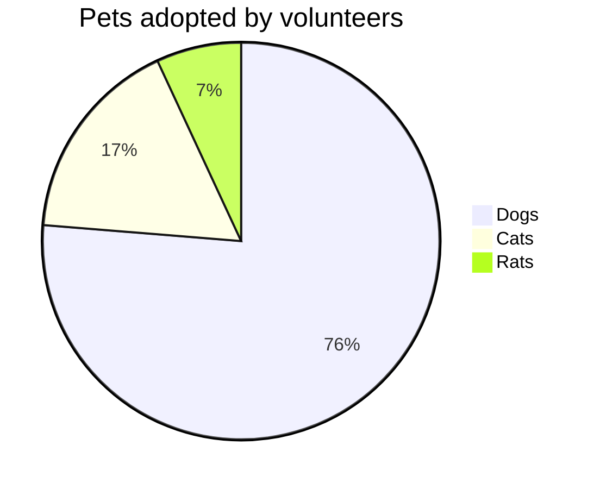

## Solution Intro

// Work in progress

|              Stage | Direct Products | ATP Yields |
| -----------------: | --------------: | ---------: |
|         Glycolysis |          2 ATP              ||
| ^^                 |          2 NADH |   3--5 ATP |
| Pyruvaye oxidation |          2 NADH |      5 ATP |
|  Citric acid cycle |          2 ATP              ||
| ^^                 |          6 NADH |     15 ATP |
| ^^                 |          2 FADH |      3 ATP |
|                               30--32 ATP        |||